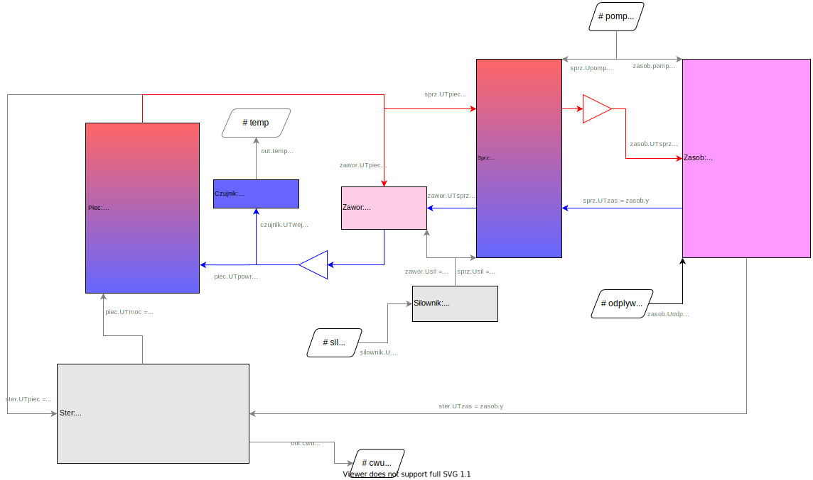

- [Dane](#dane)
  - [Wejscia](#wejscia)
  - [Wyjścia](#wyj%c5%9bcia)
  - [Parametry](#parametry)
  - [Dane wewnętrzne](#dane-wewn%c4%99trzne)
- [Algorytm](#algorytm)
  - [Mszyna stanów](#mszyna-stan%c3%b3w)
  - [Algorytm w stanie STEROWANIE](#algorytm-w-stanie-sterowanie)
  - [Ogólny opis algorytmu szacowania pochodnej](#og%c3%b3lny-opis-algorytmu-szacowania-pochodnej)
- [GUI](#gui)

> TODO:
> Zastanowowić się nad trybem letnim: Po zakończeniu pompka ma tak długo działać, aż temperatura powrotu będzie niższa niż zadana wortość `letnia`.

Dane
====

Wejscia
-------

nazwa | typ | opis
-|-|-
temp | °C | Temperatura powrotu
cwu | bool | Działa pompa C.W.U.

Wyjścia
-------

nazwa | typ | opis
-|-|-
otw | bool | Otwieranie zaworu
zam | bool | Zamykanie zaworu
pomp | bool | Działa pompa

Parametry
---------

nr | nazwa | typ | zakres i jedn. | opis
-|-|-|-|-
1|zad | °C | 1..99 | Zadana minimalna temperatura powrotu
2|t_otw | s | 1..9'50 | Czas całkowitego otwarcia
3|t_prz | s | 1..9'50 | Czas przerwy między sterowaniami, `t_prz > max_ster`
4|max_ster | s | 1..59 | Maksymalny czas sterowania, `min_ster < max_ster < t_prz`
5|min_ster | s | 0.1..2.0 | Minimalny czas sterowania, `min_ster < max_ster`
6|wsp_p | %/°C | 0.1..99 | Współczynnik proporcjonalności: % sterowania na stopień celsjusza błedu temperatury
7|wsp_d | %/(°C/min) | 0.0..99 | Współczynnik różniczkowania: % sterowania na stopień celsjusza na min.
8|wsp_otw | 0.1 | 0.1..9.9 | Ile razy szybciej zawór ma się otwierać niż zamykać
9|t_poch | s | 1'..9' | Okres, który jest wykożystywany do oszacowania pochodnej temp. powrotu
10|zal_pomp | °C | 1..99 | Temperatura powyżej, której załącza się wyjście pompy `zal_pomp < zad`
11|odwr | bool | 0..1 | Odwróć wyjścia na zawór
12|led | % | 0..9 | Jasność świecenia wyświetlacza LED


Dane wewnętrzne
---------------

nazwa | typ | opis
-|-|-
d_temp | °C/min | Pochodna temperatury powrotu


Algorytm
========

Mszyna stanów
-------------

Stan | |
-|-
BEZCZYNNOŚĆ | Sterownik ma otwarty zawór i nic nie robi
STEROWANIE | Sterownik steruje zaworem używając sterowania PD
ZAKAŃCZANIE | Sterownik otwiera zawór

```
       cwu      +-------------+  T > t_otw
    +-----------| BEZCZYNNOŚĆ |<----------+
    |           +-------------+           |
    |                cwu                  |
    |    +----------------------------+   |
    v    v                            |   |
+------------+                   +-------------+
| STEROWANIE |                   | ZAKAŃCZANIE |
+------------+                   +-------------+
         |           !cwu             ^
         +----------------------------+
```

Algorytm w stanie STEROWANIE
----------------------------

1. Oblicz sterowanie.
   ```
   Upd = wsp_p * (zad - temp) - wsp_d * d_temp
   Ut  = Upd * t_prz
   Us  = Ut przycięte do przedziału < -max_ster, max_ster >
   U   = (Us < 0) ? (wsp_otw * Us) : Us;
   ```
2. Wykonaj sterowanie.
   * `-min_ster < U < min_ster`: `Upop = Upop + U`.
     * `-min_ster < Upop < min_ster`: Nic nie rób z zaworem.
     * w przeciwnym wypadku: `U = Upop` i wykonaj jeszcze raz punkt 2.
   * `U < 0`: otwieranie zaworu przez czas `-U`, obniżanie temp. powrotu, `Upop = 0`.
   * `U > 0`: zamykanie zaworu przez czas `U`, podnoszenie temp. powrotu, `Upop = 0`.
3. Powtarzaj poprzednie punkty z okresem `t_prz`.


Ogólny opis algorytmu szacowania pochodnej
------------------------------------------

Zgromadź próbki z poprzednich `t_poch` sekund. Wyznacz linię trędu - jej współczynnik `a` jest pochodną.

Okres `t_poch` dzielony jest na `N` części (np. 64). Każda z tych części jest próbkowana `M` razy (np. 16), a wynik uśredniany i dodawany do `N`-elementowej tablicy (cyklicznej). 


GUI
===

Ikony:
* `pompa` - gdy działa wyjście pompy `pomp`
* `zawór` - gdy w stanie innym niż BEZCZYNNOŚĆ
* `książka` - gdy w ekranie ustawień parametrów
* `°C` - gdy wyświetlana jest temperatura
* `▲` `▼` migające - gdy zawór jest sterowany
* `▲` `▼` stałe - wskazanie do wyświetlanej aktualnie wartości

Ekrany standardowe:
* Globalne klawisze:
  * `OK 5s` => `nr_par`
  * `Idle 30s` => `glowny`
* `glowny` - `58°C` ekran główny, aktualna temperatura
  * `OK` => `ulamek`
  * `▲` `▼` => `poch`
* `ulamek` - `.3°C` część ułamkowa tempratury
  * `OK` => `glowny`
* `poch`- `11▲°C` `1.6▼°C` zmiana temperatury w ciągu ostatniej minuty
  * `OK` => `glowny`
  
Ekrany konfiguracji:
* Globalne klawisze:
  * `OK 5s` => `glowny`
  * `Idle 2min` => `glowny`
* `nr_par` - wybór numeru parametru (migający): `r` - ster. ręczne, `01` `02` ... - parametry
  * `▲` `▼` - zmiana numeru
  * `OK` - wybór
* `par_liczba` - `23` `0.7°C` wybór liczby
  * arg. `min` - wartość minimalna
  * arg. `max` - wartość maksymalna
  * arg. `temp` - wyświetl ikonę `°C`
  * arg. `kropka` - pozycja kropki
  * `▲` `▼` - zmiana wartosci
  * `OK` - zatwierdzenie
* `par_ulamek` - `99.` `4.4` wybór liczby zmienno przecinkowej
  * arg. `min` - wartość minimalna
  * arg. `max` - wartość maksymalna
  * arg. `temp` - wyświetl ikonę `°C`
  * `▲` `▼` - zmiana wartosci
  * `OK` - zatwierdzenie
* `par_czas` - `23` (23s) `4.4` (4min 40s) wybór czasu
  * arg. `min` - wartość minimalna
  * arg. `max` - wartość maksymalna
  * `▲` `▼` - zmiana wartosci
  * `OK` - zatwierdzenie
* `reczne` - `r`  sterowanie ręczne
  * `▲` `▼` - włącz/wyłącz sterowanie zaworem
  * `OK` - włącz/wyłącz sterowanie pompą

Model testowy
=============

[](https://kildom.github.io/drawio/#TestModelDiagram.drawio)
